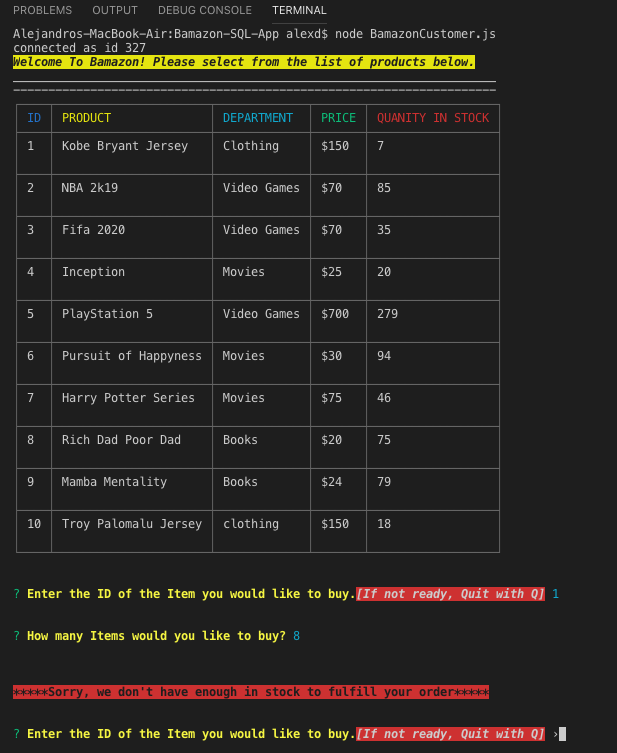

# Bamazon-SQL-App

###  Motivation & Overview 
*  This is a project for UCF's Coding bootcamp class where we are learning to use Databases thru MySQL Workbench and implementing them on NODE.JS .I have created an Amazon-like storefront with the MySQL. The app will take in orders from customers and deplete stock from the store's inventory.

# Customer Interface
Initializing node bamazon.js in the command line brings up the storefront. 
The customer interface allows the user to view the current inventory of store items: item IDs, Product, Department in which the item is located,price and Stock quantity. The user is then able to purchase one of the existing items by entering the item ID and the desired quantity. If the selected quantity is currently in stock, the user's order is fulfilled, displaying the total purchase price and updating the store database. If the desired quantity is not available, the user is prompted to modify their order.

# Customer View

* customer will be be shown a list full of products vailable for them to purchase.

* He will then be prompted with a commmand: "Enter the ID of the Item you would like to buy.[If not ready, Quit with Q]"
    * If customer is not ready he can Quit the app by pressing "Q".
    * After selecting the product the customer desires he will be asked the following: "How many Items would you like to buy?"

 
 

* Customer must select a product by using its item ID, if not he will be shown "NOT a valid Slection". same will apply if they try to type the name of the product.
 

* After customer types a desired amount, he will be shown the name of the product and if it was successfully purchased or an error message if we do not have enough product in stock. 

* If purchase is successful then it will provide the customer with a Total amount.

# Technology Used

* NPM packages (Mysql,Inquirer,Chalk,CLI-table2)
* NODE.JS
* MySQL WorkBench

